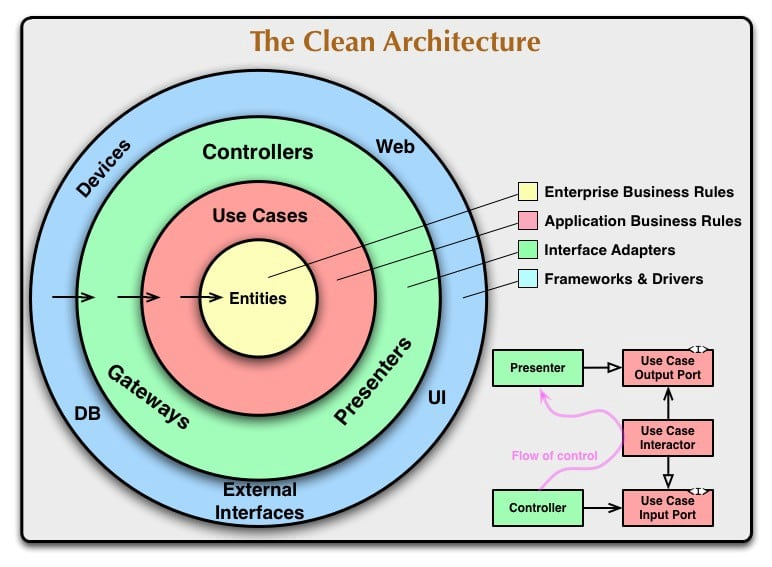

# Base-Template
Basic template for backend microservice architectures. Template is aligned with clean architecture and SOLID design principles. Adhering to this template, developers can develop applications with maintainable, flexible and much readable manner.

## Features
* Sample CRUD operations for product management.
* Cross-cutting concerns(here, it is logging) will handle using AOP concept.
* Extensible for any backend application development.
* Testability

## Supported versions

System will support the following versions.  
Other versions might also work, but we have not tested it.

* Java 8, 11
* Spring Boot 3.1.2

## Clean Architecture

Clean Architecture is a modern software design philosophy that prioritizes modularity, maintainability, and separation of concerns. At its core, Clean Architecture seeks to create software systems that are not only functional but also flexible and easy to evolve over time.

In Clean Architecture, the design is organized around distinct layers, each with its own specific responsibilities and dependencies. These layers are structured in a way that enforces a clear separation of concerns:

1. **Entities**:At the center of the architecture are the entities, representing the core business logic and rules. They are independent of any framework or external system, making them highly reusable and portable.

2. **Use Cases (Interactors)**: Use cases encapsulate the application's specific business rules and orchestrate interactions between the different layers. They define the flow of operations that the application can perform.

3. **Interface Adapters**:
   1. _Controllers/Presenters:_ These components handle communication between the application and external entities, such as user interfaces or external APIs. They are responsible for input validation, transformation, and formatting. 
   2. _Gateways/Repositories:_ Interface adapters also include gateways that abstract the communication with external systems or databases. This layer ensures that changes to external interfaces don't affect the core business logic.
4. **Frameworks and Drivers**:
   1. _Frameworks:_ This outermost layer contains the infrastructure and tools specific to the chosen technology stack. Frameworks include web frameworks, UI libraries, and databases.
   2. _Drivers:_ These are implementations of external tools and libraries required by the application, like database drivers, HTTP clients, etc.

## Contributing

Bug reports and pull requests are welcome :)